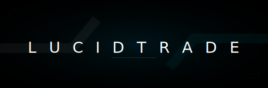

<p align="center">
  
</p>

# LucidTrade SDK for TypeScript

[](https://www.npmjs.com/package/lucid-sdk)
[](https://opensource.org/licenses/MIT)
[](https://github.com/LucidTrade/lucid-sdk/actions)

**The Professional, High-Performance SDK for the LucidTrade Cryptocurrency Exchange.**

Designed for algorithmic traders, institutional clients, and developers building on top of the LucidTrade ecosystem. This SDK provides complete access to Spot, Futures, and Wallet APIs with enterprise-grade reliability.

---

## 🚀 Features

-   **Full Type Safety**: Comprehensive TypeScript definitions for every request and response.
-   **Real-Time Data**: Robust WebSocket client with automatic reconnection and heartbeats.
-   **Advanced Authentication**: Automatic HMAC SHA256 signing and timestamp synchronization.
-   **Enterprise Reliability**: Built-in rate limiting handling and typed error hierarchy.
-   **Modular Architecture**: Tree-shakable modules for Spot, Futures, and Account management.
-   **Pluggable Logging**: Integrate with your own logging infrastructure (Winston, Pino, etc.).

## 📦 Installation

```bash
npm install lucid-sdk
# or
yarn add lucid-sdk
```

## 🛠 Usage

### Initialization

```typescript
import { Lucid, LogLevel } from 'lucid-sdk';

const client = new Lucid({
  apiKey: 'YOUR_API_KEY',
  apiSecret: 'YOUR_API_SECRET',
  // Optional: Advanced Configuration
  timeout: 5000,
  syncTime: true, // Auto-sync client time with server
  logger: new ConsoleLogger(LogLevel.INFO), // Or your custom logger
});
```

### 📈 Market Data (Spot)

```typescript
// Get 24hr Ticker
const ticker = await client.market.getTicker('BTCUSDT');
console.log(`BTC Price: ${ticker.lastPrice}`);

// Get Order Book
const depth = await client.market.getOrderBook('BTCUSDT', 50);
console.log('Best Bid:', depth.bids[0]);
```

### ⚡️ Real-Time WebSocket

```typescript
// Connect to WebSocket
client.ws.on('connect', () => {
  console.log('Connected to LucidTrade Stream');
  
  // Subscribe to channels
  client.ws.subscribe(['btcusdt@ticker', 'btcusdt@depth']);
});

// Handle Data Events
client.ws.on('ticker', (data) => {
  console.log('Tick:', data.s, data.c);
});

client.ws.on('orderBook', (depth) => {
  console.log('Depth Update:', depth.u);
});

// Automatic reconnection is handled internally.
```

### 💰 Trading (Spot & Futures)

```typescript
import { OrderSide, OrderType } from 'lucid-sdk';

// Place Spot Limit Order
const order = await client.trade.createOrder({
  symbol: 'BTCUSDT',
  side: OrderSide.BUY,
  type: OrderType.LIMIT,
  quantity: '0.1',
  price: '45000',
});

// Adjust Futures Leverage
await client.futures.changeLeverage('ETHUSDT', 10);

// Get Futures Positions
const positions = await client.futures.getPositions();
console.log(positions);
```

## 🛡 Error Handling

The SDK throws typed errors for easier handling:

```typescript
import { AuthenticationError, RateLimitError } from 'lucid-sdk';

try {
  await client.trade.createOrder({ ... });
} catch (error) {
  if (error instanceof AuthenticationError) {
    console.error('Check your API keys!');
  } else if (error instanceof RateLimitError) {
    console.warn(`Rate limited. Retry after ${error.retryAfter}ms`);
  } else {
    console.error('Unknown error:', error);
  }
}
```

## � Daydreams AI Integration

Build autonomous trading agents in minutes using [Daydreams AI](https://github.com/daydreamsai/daydreams). The SDK exports a pre-configured context with all necessary actions.

### Installation

```bash
npm install @daydreamsai/core zod
```

### Usage

```typescript
import { createDreams } from '@daydreamsai/core';
import { Lucid, Daydreams } from 'lucid-sdk';

// 1. Initialize Lucid Client
const client = new Lucid({
  apiKey: process.env.LUCID_API_KEY,
  apiSecret: process.env.LUCID_API_SECRET,
});

// 2. Create the Context
const tradingContext = Daydreams.createLucidContext(client);

// 3. Build the Agent
const agent = createDreams({
  context: tradingContext,
  model: 'openai:gpt-4o', // Or any supported model
  instructions: `
    You are a professional crypto trading bot.
    - Check the price of BTCUSDT.
    - If the price is below 50000, buy 0.01 BTC.
    - Always check account balance before trading.
  `,
});

// 4. Run the Agent
await agent.run();
```

## �🤝 Contributing

We welcome contributions! Please see [CONTRIBUTING.md](CONTRIBUTING.md) for details.

## 📄 License

MIT © 2026 LucidTrade
